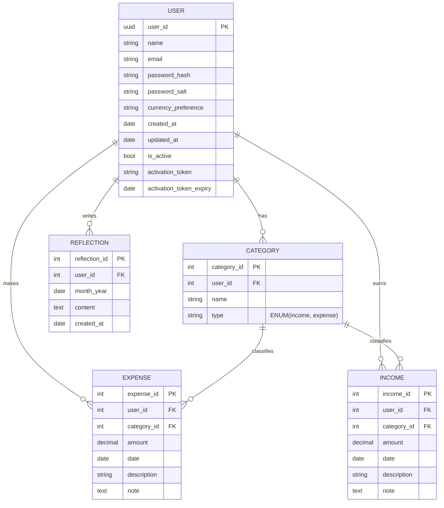
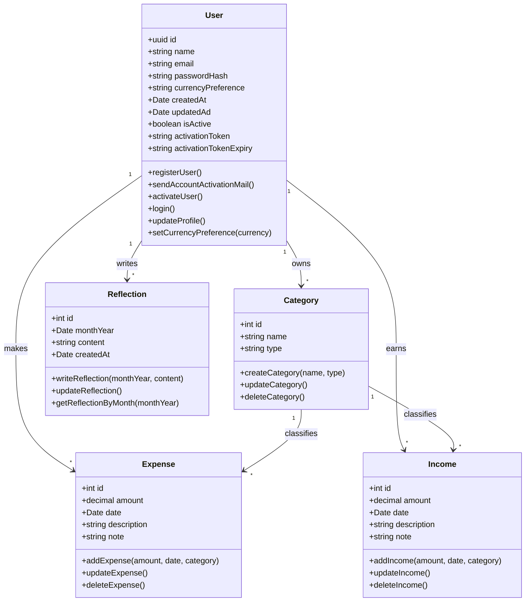

# My Kakeibo

A personal finance tracker inspired by the Japanese practice of **Kakeibo (家計簿)**.  
The goal is not only to track income and expenses, but also to **reflect** on spending habits and increase financial awareness.

---

## Features
- Record **expenses** and **income**.
- Organize entries into **categories**.
- Write **monthly reflections** (thoughts and observations).
- Multi-user support with customizable preferences (currency, categories, etc.).
- API-first design for future frontend integration.

---

## Database Design (ER Diagram)

The app uses a relational database.  
Each user can create categories, log incomes and expenses, and write reflections at the end of each month.  

---

## System Design (UML Diagram)

